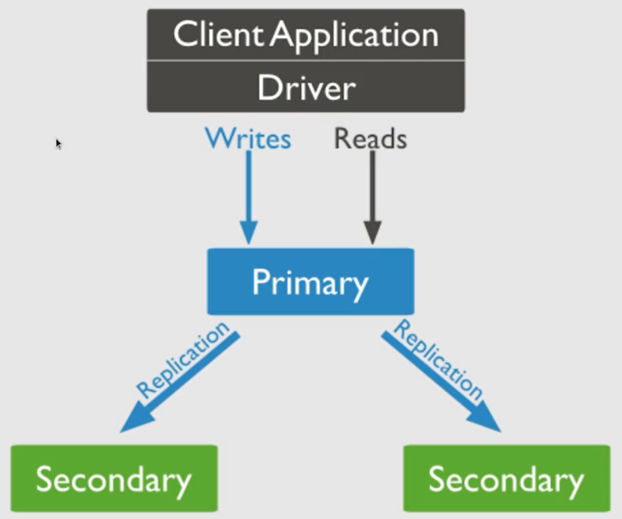

# 3.6.14 – Replicação e Fragmentação

## Replicação

- Processo de sincronização de dados em vários servidores
- Fornece redundância e aumenta a disponibilidade a disponibilidade de dados
- Usa várias cópias de dados em diferentes servidores de banco de dados
- Protege um banco de dados da perda de um único servidor
- Permite que se recupere de falhas de hardware e interrupções de serviços
- Cópias adicionais de dados permitem recuperação de desastres
- Geração de relatórios ou backup
- Manter os dados seguros
- Alta isponibilidade de dados
- Recuperação de desastres
- Sem tempo de inatividade para manutenção
- Backups, reconstruções de índices, compactação
- Melhora a escala de leitura (cópias extras para leitura)
- Conjunto de réplicas é tranparente para o aplicativo

## Processo

- Acança a replicação pelo conjunto de réplicas 
- Conjunto de réplicas: um grupo de instâncias MongoDB que hospedam o mesmo conjunto de dados
- Um nó é um nó primário que recebe todas as operações de gravação
- As outras instâncias como secundárias, aplicam operações da primária
- Assim tenham o mesmo conjunto de dados
- O conjunto de réplicas pode ter apenas um nó primário
- O conjunto de réplicas é um grupo de dois ou mais nós, geralmente 3 nós
- Os dados são replicados do nó primário para o secundário
- No momento da manutenção é estabelecida a ordem para o primário
- Um novo nó é eleito, depois da recuperação do nó com falha este se junta novamente ao conjunto de réplicas e funciona como um nó secundário



- Aplicativo cliente sempre interage com o nó primário
- O nó primário então replica os dados para os nós secundários

## Replicação do MongoDB

- Recursos do conjunto de réplicas
- Um cluster de N nós
- Qualquer nó pode ser primário
- Todas as operaçõs de gravação vão para o primário
- Recuperação automática
- Configurar um conjunto de réplicas

## Passos do processo de réplica:

- Encerrar o servidor MongoDB já em execução
- Iniciar o servidor MongoDB especificando a opção

```mongod --port "PORT" --dbpath "YOUR_DB_DATA_PATH" --replSet "REPLICA_SET_INSTANCE_NAME"```

Exemplo:

```mongod --port 24017 --dbpath "D:\set up\mongodb\data" --replSet rs0```

- Inicia uma instância mongod com o nome rs0, na porta 27017
- Inicie o prompt de comando e conecte-se a nova instãncia mongod
- Emita o comando ```rs.initiate()``` para iniciar um novo conjunto de réplicas 
- Verifique a configuração do conjunto de réplicas: ```rs.config()```
- Verifique o status do conjunto de réplicas: ```rs.status()```
- Adicionar membros ao conjunto de réplicas:
  - inicie instâncias MongoDB em várias máquinas
  - inicie um cliente mongo e emita um comando ```rs.add()```
  
  ```rs.add(HOST_NAME:PORT)```

  ```rs.add("mongo1.net:27017")```

- Adicionar a instância mongodao conjunto de réplicas, somente quando estiver conectado ao nó primário
- Para verificar se está conectado ao nó primário ou não: ```db.isMaster()```

## Fragmentação (Sharding)

- Sharding: processo de armazenar registro de dados em várias máquinas
- Abordagem do MongoDB para atender às demandas de crescimento de dados, conforme o tamanho de dados aumenta
- Uma única máquina pode não ser suficien
- te para armazenar os dados, nem fornecer uma taxa de transferência de leitura e gravação aceitável
- Sharding resolve o problema com escala horizontal
- Fragmentação: mais máquinas para dar suporte ao crescimento de dados, as demandas de operações de leitura e gravação
- Justificativa para usar a fragmentação:
  - mesmo que se tenha a replicação, todas as gravações vão para o nó mestre
  - consultas sensíveis a latência ainda vão para o mestre
  - conjunto de réplica única tem limitação de 12 nós
  - memória não pode ser grande o suficiente quando o conjunto de dados ativo é grande
  - disco local não é grande o suficiente
  - escala vertical é muito cara
  - Componentes usados no conceito de Sharding:
    - Shards
      - são usados para armazenar dados
      - fornecem alta disponibilidade
      - consistência de dados
      - ambiente de produção: cada fragmento é um conjunto de réplicas separado
    - Servidores de configuração:
      - armazenam os metadados do cluster
      - esses metadados contém um mapeamento do conjunto de dados do cluster
      - o roteador de consulta usa esses metadados para direcionar operações específicas
      - ambiente de produção: os clusters fragmentados tem exatamente 3 servidores de configuração
    - Roteadores de consulta:
      - instâncias mongo
      - interface com aplicativos cliente
      - operações diretas para o shard apropriado
      - roteador de consulta processa e direciona operações
      - retorna os resultados para os clientes
      - um cluster fragmentado pode conter mais de um roteador de consulta para dividir a carga de solicitação do cliente
      - cliente envia solicitações para um roteador de consulta
      - cluster fragmentado tem muitos roteadores de consulta